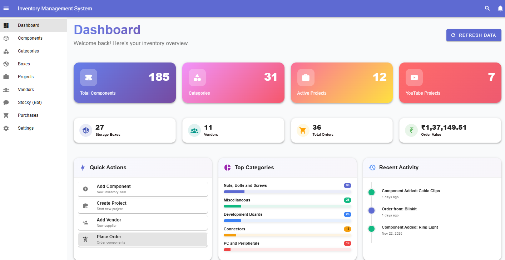
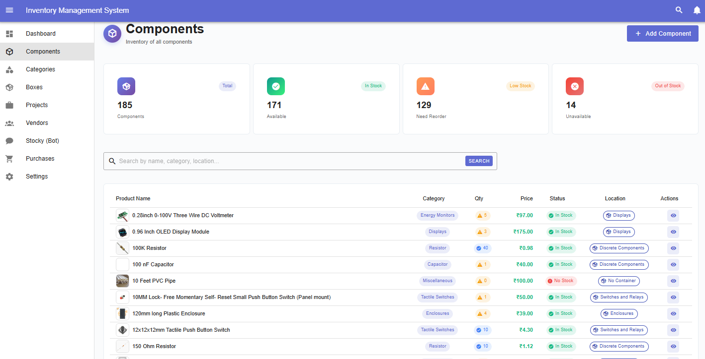
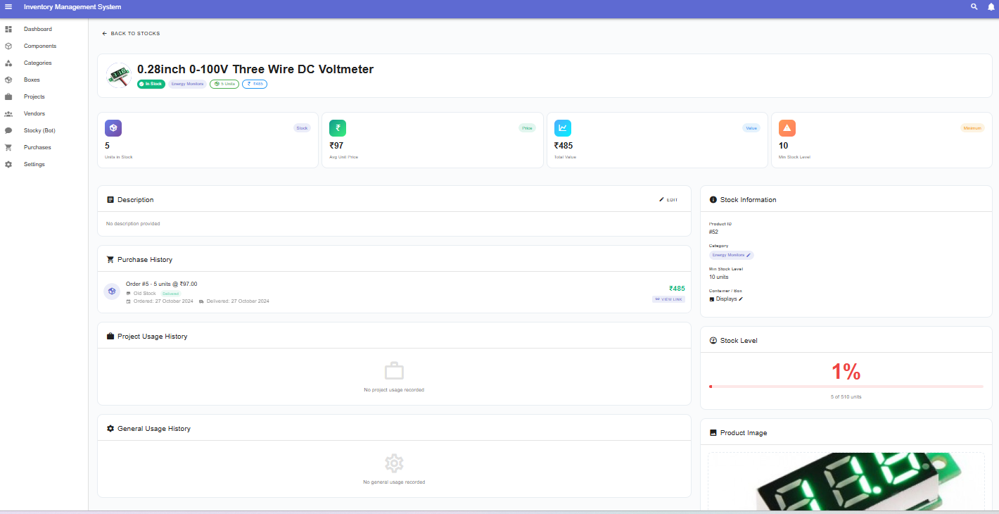

# 📦 Inventory Management System

**A modern, full-stack inventory management solution for home labs and small-scale operations**

[Features](#-features) • [Getting Started](#-getting-started)

---

## 🌟 Overview

A comprehensive inventory tracking system built with Vue 3 and powered by n8n workflow automation. Perfect for home labs, maker spaces, electronics hobbyists, and small businesses who need to track components, parts, and materials efficiently.

## ✨ Features

### 📊 Core Modules

- **📦 Stock Management** - Track inventory levels, prices, and locations with real-time updates
- **🏷️ Category Organization** - Organize items with customizable categories and tags
- **📍 Storage Locations** - Manage warehouse boxes, shelves, bins, and storage zones
- **🎯 Project Tracking** - Link inventory to projects with progress monitoring and budgets
- **🤝 Vendor Management** - Maintain supplier relationships, ratings, and contact information

### 🎨 User Experience

- **🎛️ Modern Dashboard** - Real-time KPIs, metrics, and activity timeline
- **🌓 Dark Mode** - Eye-friendly theme with automatic persistence
- **📱 Responsive Design** - Optimized for desktop, tablet, and mobile
- **🔍 Advanced Search** - Debounced search with instant results
- **📄 Detail Views** - Comprehensive item pages with complete information
- **⚙️ Settings Panel** - Customizable preferences and app configuration

### ⚡ Performance & Technical

- **💾 Smart Caching** - Configurable cache timeout (default 5 minutes)
- **🚀 Lazy Loading** - Route-based code splitting for faster initial load
- **🔄 Optimized Stores** - Reusable composables reduce code by 40%
- **🎯 Error Handling** - Comprehensive error states with user-friendly messages
- **📊 Pagination** - Efficient data loading with customizable page sizes

---

## 🖼️ Screenshots

### Dashboard

### Stock Management

### Detail View

---

## 🏗️ Tech Stack

### Frontend
| Technology | Version | Purpose |
|-----------|---------|---------|
| Vue 3 | 3.5+ | Progressive JavaScript framework |
| Vuetify 3 | 3.7+ | Material Design component library |
| Vite | 5.4+ | Next-generation build tool |
| Pinia | 2.2+ | State management |
| Vue Router | 4.4+ | Client-side routing |
| Axios | 1.7+ | HTTP client |

### Backend
| Technology | Purpose |
|-----------|---------|
| n8n | Workflow automation & API endpoints |
| PostgreSQL | Relational database |
| Docker | Containerization |

---

## 🚀 Getting Started

### Prerequisites

Before you begin, ensure you have the following installed:

- **Node.js** 18.x or higher ([Download](https://nodejs.org/))
- **npm** 9.x or higher (comes with Node.js)
- **Git** ([Download](https://git-scm.com/))
- **n8n** instance running ([Setup Guide](#setting-up-n8n-backend))
- **PostgreSQL** 14+ database ([Setup Guide](#database-setup))

### Quick Start (5 minutes)

## ✨ Features

- 📦 Stock Management - Track inventory with real-time updates
- 🏷️ Category Organization - Organize with tags
- 📍 Storage Locations - Manage warehouse boxes
- 🎯 Project Tracking - Link inventory to projects
- 🤝 Vendor Management - Supplier relationships

## 🏗️ Tech Stack

**Frontend:** Vue 3, Vuetify 3, Vite, Pinia, Vue Router, Axios  
**Backend:** n8n, PostgreSQL, Docker

## 🤝 Contributing

Contributions welcome! Open an issue or submit a PR